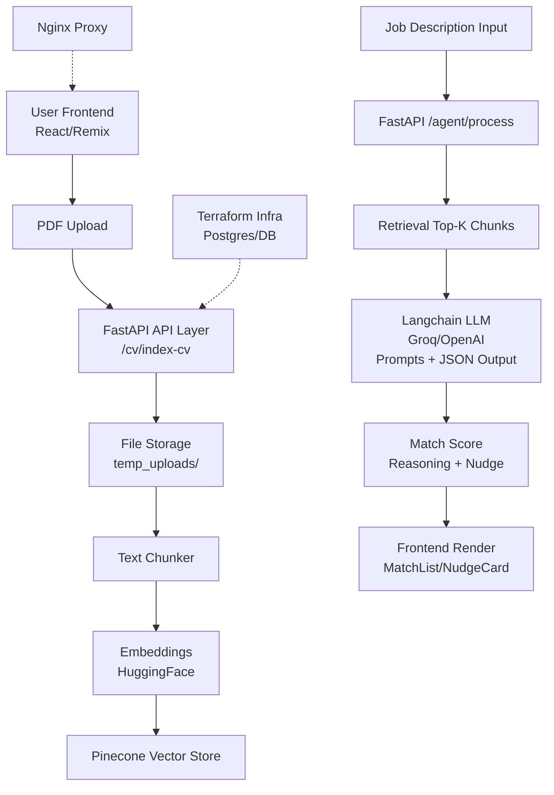

# ApplyFlow AI [](https://github.com/allanimire/ApplyFlow_AI) [](https://docker.com) [](https://fastapi.tiangolo.com) [](https://react.dev)

ApplyFlow AI is an **AI-powered job application optimizer** solving the "last-mile" problem: transform your **resume (CV) + job description** into **actionable strategies**, **personalized recruiter nudges**, and **match scores** via semantic retrieval and LLM analysis.

## 📋 Table of Contents

- [🔧 Core Architecture](#core-architecture)
- [🔐 Authentication](#authentication)
- [🌐 API Layer](#api-layer)
- [📁 File Handling](#file-handling)
- [🤖 AI Integration](#ai-integration)
- [🎨 Frontend](#frontend)
- [🚀 Deployment](#deployment)
- [🏗️ Repository Design & Patterns](#repository-design--patterns)
- [⚡ Quickstart](#quickstart)
- [🔑 Environment Variables](#environment-variables)
- [📚 Documentation](#documentation)
- [🤝 Contributing](#contributing)

## 🎯 Overview

| Feature           | Description                                                                        |
| ----------------- | ---------------------------------------------------------------------------------- |
| **CV Processing** | PDF upload → text chunking → embeddings → Pinecone storage/retrieval               |
| **Job Matching**  | Semantic search on chunks, top-k retrieval, LLM scoring (1-10) + reasoning + nudge |
| **UI**            | Remix/React app for upload, search, match visualization, copy-to-clipboard nudges  |
| **Automation**    | Nudger service (future: scheduled outreach)                                        |

## Repository Layout

- **`frontend/`**: React Router v7 + Vite + Tailwind UI
- **`ai_engine/`**: FastAPI backend providing CV indexing + retrieval + LLM orchestration (LangChain)
- **`nudger/`**: Node/TypeScript service intended for scheduled “nudge” automation (currently a DB connectivity + placeholder scaffold)
- **`docker-compose.yml`**: local orchestration (frontend + ai_engine + nudger + Postgres)

## 🔧 Core Architecture

### 🏗️ High-Level Data Flow (Mermaid Diagram)



### 🛠️ Backend Layers (Clean Architecture / Ports & Adapters)

| Layer                | Path                | Responsibility                                                                                                      |
| -------------------- | ------------------- | ------------------------------------------------------------------------------------------------------------------- |
| **Domain**           | `core/domain/`      | Entities (CV chunks, jobs), Value Objects, Domain Services, Repositories (ports), Exceptions                        |
| **Application**      | `core/application/` | Use Cases/Services, Ports/Interfaces for infra                                                                      |
| **Infrastructure**   | `infrastructure/`   | Adapters: db/repositories (SQLAlchemy/Postgres), vector/Pinecone, llm/Langchain, auth/Google+JWT, filestorage/local |
| **Presentation/API** | `api/`              | FastAPI routes (auth/cv/job), Schemas (Pydantic), Dependencies, Exception Handlers                                  |
| **Core Utils**       | `core/utils/`       | Text chunker, Security (JWT), Middleware (timing), Config (Pydantic), Container (DI)                                |

## ⚡ Quickstart

1. Clone & `.env` (see [Environment Variables](#environment-variables)).
2. **Local Dev**:
   ```bash
   docker compose -f docker-compose.local.yml up --build
   ```
3. Open:
   | Service | URL |
   |---------|-----|
   | Frontend | http://localhost:5173 |
   | API Health | http://localhost:8000/health |
   | Postgres | localhost:5432

See [docs/LOCAL_DEV.md](docs/LOCAL_DEV.md) for troubleshooting.

## 🔑 Environment Variables

Copy `.env.example` (created) to `.env` and fill values. Loaded by docker-compose `env_file: .env`.

**Key Vars**:
| Var | Purpose |
|-----|---------|
| `PINECONE_API_KEY` | Vector DB access |
| `LLM_PROVIDER`/`GROQ_API_KEY`/`OPENAI_API_KEY` | AI models |
| `DATABASE_URL` | Postgres (nudger) |
| `VITE_AI_API_URL` | Backend base URL |

## 🔐 Authentication

- **JWT**: `core/security/jwt.py` - Token generation/validation.
- **Google OAuth**: `infrastructure/auth/google.py`.
- **Dependencies**: `api/dependencies/user.py`, `core/security/dependencies.py`.

## 🌐 API Layer

FastAPI app (`ai_engine/main.py`):

- **Routes**: `api/routes/auth_routes.py`, `cv_routes.py`, `job_routes.py`.
- **Schemas**: Pydantic models (`api/schemas/cv_schema.py`, `user_schema.py`, etc.).
- **Handlers**: `api/exception_handlers.py`.
- **Health**: `GET /health`.
- Full spec: [docs/API.md](docs/API.md).

## 📁 File Handling

- **Upload**: Multipart form to `/cv/index-cv` → `infrastructure/filestorage/local_file_storage.py`.
- **Processing**: `core/utils/text_chunker.py` → PDF text extraction + semantic chunks.
- **Storage**: `temp_uploads/` (local; extensible to S3).

## 🤖 AI Integration Layer

- **Embeddings**: HuggingFace `all-MiniLM-L6-v2` (dim=384) → `infrastructure/vector/pinecone_vector_store.py`.
- **Vector Store**: Pinecone index (`applyflow-cvs`), upsert/retrieve.
- **LLM Orchestration**: `infrastructure/llm/langchain_llm_adapter.py` + `models/prompts.py`.
- **Providers**: Groq (Llama3) or OpenAI (GPT-4o-mini).
- **Output**: Structured JSON per chunk: `{score: 1-10, reasoning, nudge}` via `/agent/process`.

## 🎨 Frontend Structure

Remix/React Router v7 + Vite + Tailwind + TypeScript:
| Part | Path/Details |
|------|--------------|
| **Entry** | `app/entry.client.tsx`, `root.tsx`, `routes.ts` |
| **Routes** | `landing.tsx`, `dashboard_layout.tsx` |
| **Components** | `UploadForm.tsx`, `MatchList.tsx`, `NudgeCard.tsx`, `Score.tsx` |
| **Helpers/Hooks** | `useMousePosition.tsx`, API utils, PostHog |
| **Config** | `vite.config.ts`, `playwright.config.ts`, `vitest.config.ts` |

## 🚀 Deployment Patterns

- **Local**: `docker-compose.local.yml` (frontend:5173, ai_engine:8000, nudger, postgres).
- **Test/Prod**: `docker-compose.test.prod.yml`.
- **Proxy**: `nginx/default.conf` (root_path="/api").
- **Infra**: Terraform (`main.tf`, AWS EC2/SG, user_data.sh provisioning).
- **Images**: Dockerfiles per service (frontend/, ai_engine/, nudger/).

## 🏗️ Repository Design & Patterns

- **Architecture**: **Clean/Hexagonal** (Ports & Adapters): Domain pure, infra swappable.
- **DDD**: Rich models/repositories/services (`core/domain/`).
- **DI**: `core/container.py`.
- **Config**: `core/config/settings.py` (Pydantic).
- **DB**: SQLAlchemy + Alembic migrations (`migrations/`).
- **Testing**: pytest (`requirements_dev.txt`), Vitest/Playwright (frontend/tests/).
- **Monorepo**: Services + shared docs/terraform/nginx.
- **CI/CD Ready**: Makefiles, pre-commit.

## Tech Stack

- **Frontend**: `React Router v7`, `Vite`, `Tailwind CSS`, `TypeScript`
- **Backend**: `FastAPI`, `LangChain`, `LangChain-Community`
- **Vector DB**: `Pinecone`
- **LLM**: `Groq (Llama 3.3-70b)` or `OpenAI (GPT-4o-mini)`
- **Embeddings**: `HuggingFace (all-MiniLM-L6-v2)`
- **Database**: `PostgreSQL` (for nudger)

## 📚 Documentation & Contributing

**Docs**:
| Guide | Link |
|-------|------|
| API | [docs/API.md](docs/API.md) |
| Local Dev | [docs/LOCAL_DEV.md](docs/LOCAL_DEV.md) |
| Deployment | [docs/OPS.md](docs/OPS.md) |
| Designs | SDS/TDD/PRD in `docs/` |

**Contribute**:

1. `cp .env.example .env` & edit.
2. `docker compose up --build`.
3. Test: `make test` (backend), `npm test` (frontend).
4. PR: Conventional commits, changelog entry.

**Roadmap**: Multi-CV support, nudger scheduling, analytics dashboard.
